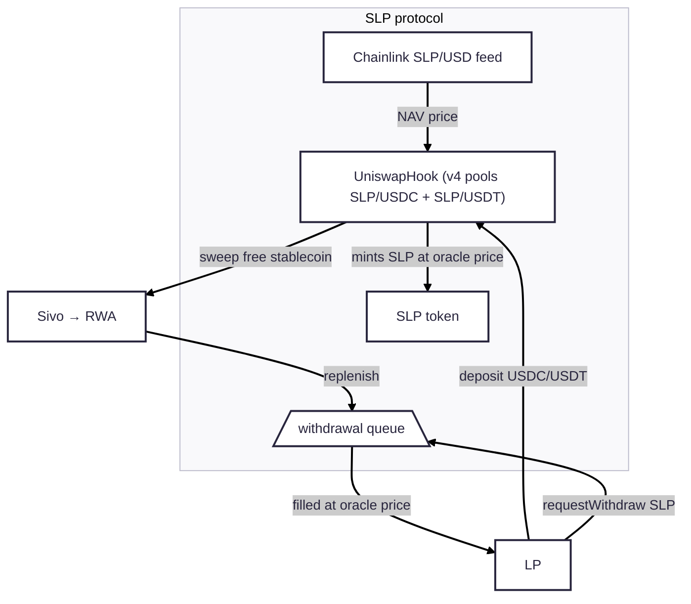

# Sivo SLP Protocol — EVM Contracts

The smart contracts of Sivo's SLP protocol, live on Ethereum mainnet, plus
the deployment and operations tooling around them. The protocol is the **SLP
model** (the ERC-4626/7540 Vault/Share stack it replaced was retired before
this repository was published; the retired contracts remain deployed
on-chain):

- **SLP** is a plain UUPS ERC-20 token (mintable/burnable through a central
  OpenZeppelin `AccessManager`). All value appreciation is reflected in its
  Chainlink NAV price — there is no on-chain accrual.
- **UniswapHook** is one Uniswap v4 hook serving the SLP/USDC and SLP/USDT
  pools. Deposits swap a stablecoin for freshly minted SLP at the exact
  oracle price (the pools hold zero curve liquidity — every swap is absorbed
  by the hook's custom accounting); exits queue SLP in the hook's
  asynchronous FIFO withdrawal queue, filled by inbound deposits and operator
  replenishment at the oracle price current at fill time. Deposited
  stablecoin is swept by Sivo for RWA deployment, except the reserve backing
  filled-but-unclaimed withdrawals.



## Deploying to a new chain

Follow these steps to deploy the vault contract on a blockchain network for the first time (also read these steps to review prerequisites for existing chains):

### 1. Update Chain Configuration

- Add the new chain to `evmChainMap` in `config/chains.ts`
- If Alchemy supports the chain, add the network to `alchemyRpcUrls` in the
  same file (otherwise set an `RPC_URL_<NETWORK>` override in `.env`)
  - Also add the new network to the sivo.xyz apps in the Alchemy dashboard

### 2. Configure Hardhat

- `hardhat.config.ts` derives its networks from `config/chains.ts`; review
  the generated entry for the new chain

### 3. Set Up Wallet and Funding

- Set `SIVO_WALLET_PRIVATE_KEY` in `.env.local` from AWS Secret Manager (`seller/wallet-private-key`)
- For a devnet: Find a faucet to add native tokens for gas
- For a mainnet: Purchase the necessary tokens

## Deploying the SLP protocol (SLP token + UniswapHook + Uniswap v4 pools)

Roles for both contracts live in a central OpenZeppelin `AccessManager`.
After deployment succeeds, commit all changes under
`ignition/deployments` (only after initial creation, never
for upgrades).

The hook proxy's address must encode its permission flags in the low 14 bits
(`0x28A8`), so deployment is a five-step sequence:

### 1. Deploy AccessManager, SLP, and the hook implementation

```bash
npm run slp:create -- --network {xyz} --parameters ./ignition/parameters/{xyz}.json
```

On testnets without Chainlink feeds, first deploy the test feeds and put
their addresses into the `HookProxy` parameters. The self-accruing
`SlpTestOracle` (reads 1.00 at deployment, grows linearly at
`SlpTestOracleModule.apy_bps` per year and is never stale, so no publisher is
needed) goes into `HookProxy.oracle`; the fixed-price `OracleHarness` serves
as the stablecoin peg feed in `HookProxy.usdc_oracle` / `usdt_oracle`:

```bash
npm run oracle:test -- --network {xyz} --parameters ./ignition/parameters/{xyz}.json
npm run oracle:harness -- --network {xyz} --parameters ./ignition/parameters/{xyz}.json
```

On a running testnet, re-point the hook at a freshly deployed test feed with
`npx hardhat run scripts/set-oracle.ts --network {xyz}` (caller must hold
MANAGER) and change the rate later via `SlpTestOracle.setApy` (owner).

### 2. Mine and deploy the hook proxy

All `HookProxy` parameters in `ignition/parameters/{xyz}.json` must be FINAL —
the initialize calldata is part of the CREATE2 init code, so changing any
option changes the mined address.

```bash
npm run slp:hook-proxy -- --network {xyz}
```

The script mines a salt against the canonical deterministic-deployment proxy
(`0x4e59b44847b379578588920cA78FbF26c0B4956C`), deploys, verifies the flag
bits, and prints the hook address. Copy it into the `SlpRolesModule.hook`
parameter.

### 3. Initialize the pools

```bash
npm run slp:pools -- --network {xyz}
```

This initializes both sanctioned pools on the PoolManager with the keys read
from the hook itself (a plain script rather than Ignition: Ignition cannot
pass the struct returned by `hook.poolKey` into `PoolManager.initialize`).
Idempotent — already-initialized pools are skipped.

### 4. Wire the AccessManager roles

```bash
npm run slp:roles -- --network {xyz} --parameters ./ignition/parameters/{xyz}.json
```

This maps the function-role assignments (MINTER/MANAGER/OPERATOR/PAUSER, see
`ignition/modules/hook/roles.ts`) and grants MINTER to the hook.

### 5. Update the contract registry

Add the SLP proxy, hook proxy, feed, PoolManager, and deploy block to the
`SlpMarkets` registry in the `@holasivo/evm` package (Sivo-internal) and
release the package.

## Upgrading contracts

Contracts use the [UUPS (Universal Upgradeable Proxy Standard)](https://docs.openzeppelin.com/contracts-stylus/uups-proxy) proxy pattern. In UUPS, the upgrade logic resides in the implementation contract rather than the proxy, keeping proxies lightweight and gas-efficient.

The upgrade process is multisig. The following scripts should be executed using a proposer wallet for the `SIVO_WALLET_PRIVATE_KEY`.

### 1. Create and Verify Implementation Contracts

```bash
npm run slp:upgrade -- --network {xyz} --parameters ./ignition/parameters/{xyz}.json
npm run hook:upgrade -- --network {xyz} --parameters ./ignition/parameters/{xyz}.json
```

This creates and verifies the new implementation contracts (the hook
implementation constructor takes the PoolManager address — an immutable — on
every upgrade). The `upgradeAndCall` is not executed by these scripts.

### 2. Retain Deployment Journals

After the implementation contracts are created, retain the deployment journals generated by Hardhat under `ignition/deployments`. They are required for the next step.

### 3. Propose Upgrades to Safe Wallet

Run this command:

```bash
npm run slp:propose -- --network {xyz}
```

### 4. Sign and Execute

2 out of 3 signers need to sign and execute the upgrade transactions in the Safe Wallet.

### 5. Cleanup

After transactions are proposed, delete the Hardhat Ignition deployment files. They should not be committed to source control.

## Validation

After deployment, validate that the contract is working correctly by interacting with it through the SDK or directly via ethers/viem.

## Troubleshooting

- If deployment fails due to gas issues, ensure your wallet has sufficient funds
- For RPC errors, check that the RPC URL is correctly configured in hardhat.config.ts

## Audits

See [`audits/`](audits/) for the CredShields audit report (August 2026).
Formal verification specs and configuration live under
[`certora/`](certora/).

## License

This repository is licensed under the [Business Source License 1.1](LICENSE)
(Change Date 2030-08-29, Change License GPL-2.0-or-later): the source is
available for reading, auditing, modification, and non-production use, and
converts to an open-source license on the Change Date. Individual files whose
`SPDX-License-Identifier` header names a different license (for example the
MIT-marked test and peripheral contracts) are licensed as marked.
